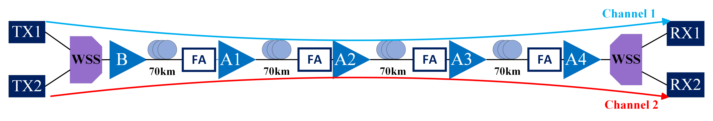

# Soft-Failure Localization Dataset — Experimental Optical Network

Dataset collected from the ARNO testbed within the InRete Lab at the TeCIP Institute, Scuola Superiore Sant'Anna (Pisa, Italy).

## Testbed
 

 
The testbed consists of four spans, each equipped with a Failure Actuator (FA) implemented via a wavelength-selective switch (WSS). Two 100 Gb/s DP-QPSK WDM channels (Channel 1 at 193.1 THz and Channel 2 at 193.2 THz) are transmitted across the setup and detected by two coherent receivers (SPO1 and SPO2). Four EDFAs are deployed along the path. Telemetry is collected through a Kafka-based monitoring framework.
 
## Failure States
 
Soft failures are generated by selectively introducing attenuation at the FA of a given span. For each of the 4 spans, three impairment configurations are considered:
 
1. Attenuation on Channel 1 only
2. Attenuation on Channel 2 only
3. Attenuation on both channels simultaneously
Since only one impairment configuration is active at a time, this produces **4 × 3 = 12 distinct soft-failure states**. Telemetry is also collected under normal operating conditions (no induced degradation), yielding a total of **13 mutually exclusive system states**. Each observation is uniquely labeled by the tuple (affected span, affected channel set), forming a 13-class failure-localization dataset.
 
## Dataset File
 
**`Dataset-ber-osnr-labels-13-clusters.csv`**
 
| Property | Value |
|---|---|
| Rows (snapshots) | 4 618 |
| Columns | 13 (12 features + 1 label) |
| Sampling period | 4 s |
| Label column | `LT` |
| Label 0 | Normal operation (3 498 snapshots) |
| Labels 1–12 | Soft-failure states (~93 snapshots each) |
 
## Column Description
 
| Column | Description |
|---|---|
| `BER_SPO1/18/11` | Pre-FEC BER measured at coherent receiver SPO1 |
| `BER_SPO2/18/11` | Pre-FEC BER measured at coherent receiver SPO2 |
| `OSNR_SPO1/18/11` | OSNR measured at coherent receiver SPO1 |
| `OSNR_SPO2/18/11` | OSNR measured at coherent receiver SPO2 |
| `Ampli1_InputPower` | Input optical power at EDFA 1 (dBm) |
| `Ampli1_OutputPower` | Output optical power at EDFA 1 (dBm) |
| `Ampli2_InputPower` | Input optical power at EDFA 2 (dBm) |
| `Ampli2_OutputPower` | Output optical power at EDFA 2 (dBm) |
| `Ampli3_InputPower` | Input optical power at EDFA 3 (dBm) |
| `Ampli3_OutputPower` | Output optical power at EDFA 3 (dBm) |
| `Ampli4_InputPower` | Input optical power at EDFA 4 (dBm) |
| `Ampli4_OutputPower` | Output optical power at EDFA 4 (dBm) |
| `LT` | Label: 0 = normal, 1–12 = soft-failure state |
 
## Citation
 
If you use this dataset, please cite:
 
```bibtex
@ARTICLE{11131468,
  author={Yeganehfallah, Azarm and Sgambelluri, Andrea and Paolini, Emilio and Soares Mayer, Kayol and Felipe Silva, Moises and Mello, Darli A. A. and Valcarenghi, Luca},
  journal={Journal of Optical Communications and Networking}, 
  title={Confidentiality-preserving real-time localization of soft failures in optical networks based on PCA and MLaaS}, 
  year={2025},
  volume={17},
  number={9},
  pages={D137-D143},
  doi={10.1364/JOCN.562802}}

```
